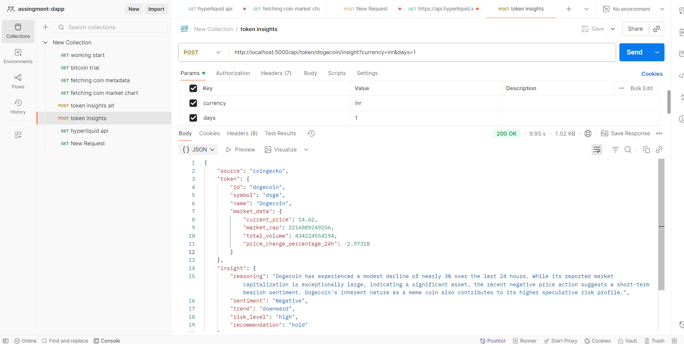

# Backend Assignment DApp

This project is a backend service provides insights on cryptocurrency tokens using CoinGecko and Gemini APIs.


## Features

- Retrieve token metadata and market data from CoinGecko.
- Generate insights based on token data using the Gemini API.
- Handle errors gracefully and provide meaningful responses.

## Technologies Used

- Node.js
- Express.js
- Axios
- dotenv
- CORS

## API Endpoints

### 1. Fetch Token Metadata

**GET** `/api/coin/:id/`

Fetches metadata for a specified cryptocurrency token.

### 2. Fetch Token Market Data

**GET** `/api/coin/:id/market`

Fetches market data for a specified cryptocurrency token.

### 3. Fetch Token Insights

**POST** `/api/token/:id/insight`

Combines fetching token metadata and market data, then generates insights based on the data.


## Setup Instructions

1. Clone the repository:
   ```bash
   git clone https://github.com/yourusername/backend-assignment-dapp.git
   cd backend-assignment-dapp
   ```

2. Install dependencies:
   ```bash
   npm install
   ```

3. Create a `.env` file in the root directory and add your API keys:
   ```plaintext
   API_KEY=your_coingecko_api_key
   GEMINI_API_KEY=your_gemini_api_key
   PORT=5000
   ```

4. Start the server:
   ```bash
   npm start
   ```
- referecne screenshot postman api testing
- 